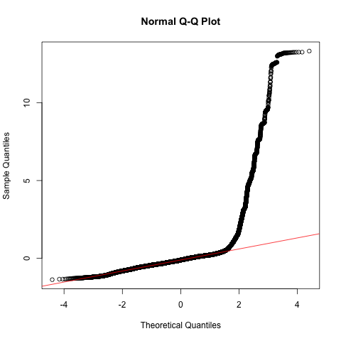
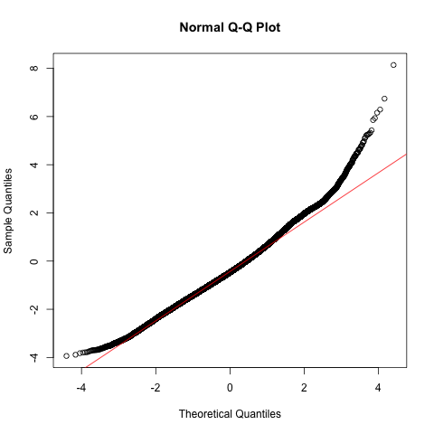

```{r echo=F,eval=F}
try(setwd("~/Documents/Bristol/FTRAccounting/FTRAccountingStudy/analysis/"))
```

```{r echo=F}
getMEText = function(r,ef, wald=NULL, showWald=F){
  
  AIC = r[2,]$AIC
  loglikDiff = signif(diff(r$logLik),2)
  chi = round(r$Chisq[2],2)
  df = r$`Chi Df`[2]
  p = signif(r$`Pr(>Chisq)`[2],2)
  
  wald.text = ""
  
  if(!is.null(wald)){
    est = signif(wald[1],2)
    stder = signif(wald[2],2)
    t = signif(wald[3],2)
    wptext = ""
    wald.text =  paste("beta = ",est,",")
    if(showWald){
      if(!is.na(wald[4])){
      wptext = paste(", Wald p =",signif(wald[4],2))
      }
    wald.text = paste("beta = ",est,", std.err = ",stder, ", Wald t = ",t,wptext,';')
    }
  }
  
  begin = 'There was no significant'
  if(p <0.09){
    begin = "There was a marginal"
  }
  if(p < 0.05){
    begin = 'There was a significant'  
  }
  
  
  return(paste(begin,ef,"(",wald.text,"log likelihood difference =",
               loglikDiff,", df = ",df,", Chi Squared =", chi,", p = ",p,")."))
}
```


# Introduction

Test the relationship between strong/weak FTR and AAM, with and without controls for language family.

# Load libraries

```{r warning=F,message=F}
library(lme4)
library(sjPlot)
library(REEMtree)
library(rpart)
library(rpart.plot)
library(MASS)
library(ggplot2)
library(RColorBrewer)
library(MCMCglmm)
```

# Load data

```{r}
d = read.csv("../data/clean/data.csv",
             fileEncoding = "utf-8",
             encoding = 'utf-8')
```

Match each country to its main language and language family:

```{r}
countryMainLanguageFamily =
  read.csv("../data/raw/CountryMainLanguageToLanguageFamily.csv",
    stringsAsFactors = F)

d$mainLanguageFamily =
  countryMainLanguageFamily[
    match(as.character(d$loc),
          countryMainLanguageFamily$Country.Code),
    ]$Family
```

Remove countries with many main language families:

```{r}
d$CountryHasManyMainLanguages = countryMainLanguageFamily[
  match(as.character(d$loc),
        countryMainLanguageFamily$Country.Code),
  ]$ManyLanguages=="Y"
d2 = d[!d$CountryHasManyMainLanguages,]

d2 = d2[!is.na(d2$AAM),]
```

Remove cases with missing data:

```{r}
keyVar = c("invpro","pd","indiv","mas",
  "ua","lto","indul","ggr","SIZE",
  "BTM","LEV","ROA","MEET","LOSS")
d2 = d2[complete.cases(d2[,keyVar,]),]
```

Convert to factors:

```{r}
d2$mainLanguageFamily = factor(d2$mainLanguageFamily)
d2$MEET = factor(d2$MEET)
d2$LOSS = factor(d2$LOSS)
d2$strongftr = factor(d2$strongftr)
```

Scale varaibles:

```{r}
d2Orig = d2
# Take log of AAM
d2$logAAM = log(1+d2$AAM)
#d2$logAAM = d2$logAAM - median(d2$logAAM,na.rm = T)
# Scale and center continuous variables
for(v in c("pd",'indiv','mas',
           'ua','lto','indul','ggr',
           'SIZE',"BTM","LEV","ROA")){
  d2[,v] = scale(d2[,v])
}
d2$AAM.scaled = scale(d2$AAM)
```

\newpage

# Mixed effects modelling

## Model A: no controls for language family

Model `mA0` is a baseline model and model `mA1` adds the effect for FTR.

```{r cache=T}
mA0 = lmer(AAM.scaled ~ 1 +
             invpro + 
             pd + indiv + mas + ua + lto + indul + 
             ggr + 
             SIZE + BTM + LEV + ROA +
             MEET + LOSS +
             (1 | fyear) +
             (1 | indus),
           data = d2)
mA1 = update(mA0,~.+strongftr)
```

Look at the estiamtes for variables within model `mA1`:

```{r}
summary(mA1)
```


Compare the fit of the two models to assess the effect of FTR:

```{r cache=T}
anova(mA0,mA1)
```

\newpage

Plot fixed effects:
```{r}
sjp.lmer(mA1,type="fe",p.kr = F)
```

\newpage

## Model B: with controls for language family

Model `mB0` is the same as `mA0`, but with controls for langauge family. Model `mB1` adds the FTR variable to the model for comparison.

```{r cache=T}
mB0= update(mA0, ~.+(1 | mainLanguageFamily))
mB1= update(mB0, ~.+strongftr)
```

Look at the estimates for `mB1`:

```{r}
summary(mB1)
```

Compare the two models to assess the significance of the FTR variable:

```{r cache=T}
anova(mB0,mB1)
```

Plot fixed effects with controls for langauge family:

```{r}
sjp.lmer(mB1,type="fe",p.kr = F)
```

## Random slopes for FTR

Test if adding a random slope for FTR by language family significantly improves the fit of the model:

```{r cache=T}
mB2 = lmer(AAM.scaled ~ 1 +
             invpro + 
             pd + indiv + mas + ua + lto + indul + 
             ggr + 
             SIZE + BTM + LEV + ROA +
             MEET + LOSS +
             strongftr +
             (1 | fyear) +
             (1 | indus) +
             (1 + strongftr | mainLanguageFamily),
           data = d2)
```

```{r cache=T}
anova(mB1,mB2)
```

Yes, model fit significantly improves. The effect of FTR is even weaker:


```{r}
summary(mB2)
```


\newpage

Plot both models (code hidden):

```{r echo=F,message=F,warning=F}

plotColours = c("black",brewer.pal(3,"Set2")[2:1])

plotA = sjp.lmer(mA1,type="fe",p.kr = F,geom.colors = c(plotColours[1],plotColours[1]),prnt.plot = F)
plotB = sjp.lmer(mB1,type="fe",p.kr = F,geom.colors = c(plotColours[2],plotColours[2]),prnt.plot = F)
plotB2 = sjp.lmer(mB2,type="fe",p.kr = F,geom.colors = c(plotColours[3],plotColours[3]),prnt.plot = F)

x_B2Points = 1:length(plotB2$data$term)
x_BPoints = x_B2Points + 0.33
x_APoints = x_B2Points + 0.66

plotBoth = function(plotA,plotB,plotB2,showB=T,xlim=c(-0.5,0.5)){
  par(mar=c(3,5,4,1))
  plot(xlim,c(1,15.5),type='n',yaxt='n',xlab="",ylab="")
  abline(h=x_B2Points-0.16,col="gray")
  
  points(plotA$data$estimate,x_APoints,pch=16,col=plotColours[1])
  arrows(plotA$data$conf.low,x_APoints,
         plotA$data$conf.high,x_APoints, 
         code=3,angle = 90,length = 0.1)
  if(showB){
    points(plotB$data$estimate,x_BPoints,
           col=plotColours[2],pch=16)
    arrows(plotB$data$conf.low,x_BPoints,
           plotB$data$conf.high,x_BPoints,
           code=3,angle = 90,length = 0.1,col=plotColours[2])
    points(plotB2$data$estimate,
           x_B2Points,
           col=plotColours[3],pch=16)
    arrows(plotB2$data$conf.low,x_B2Points,
           plotB$data$conf.high,x_B2Points,
           code=3,angle = 90,length = 0.1,col=plotColours[3])
    
  }
  axis(2,at=x_B2Points+0.25,labels = plotA$data$term,las=2)
  abline(v=0)
  legend(-0.5,19.5,bty='n',
         xpd=T,legend=
           c("Without language family controls",
             "With language family controls",
             "With langauge family controls (and random slopes)"),
         ncol=1,
         lty=1,col=plotColours,
         text.col=plotColours)
}

plotBoth(plotA,plotB,plotB2)

pdf("../results/singleMembershipModel.pdf",
    width=6,height=5)
  plotBoth(plotA,plotB,plotB2)
dev.off()

pdf("../results/singleMembershipModel_AOnly.pdf",
    width=6,height=5)
  plotBoth(plotA,plotB,plotB2,F)
dev.off()

```

# Summary

Without a random intercept by main language family: `r getMEText(anova(mA0,mA1), "main effect of FTR",summary(mA1)$coef['strongftr1',])`

With a random intercept by main language family: `r getMEText(anova(mB0,mB1), "main effect of FTR",summary(mB1)$coef['strongftr1',])`

\newpage

# Alternative tests

\newpage

## Gamma distribution model

The distribution of the AAM variable is highly skewed and values below zero are not permitted:

```{r}
hist(d2$AAM)
normalDist = rnorm(n=length(d2$AAM),
                   mean = mean(d2$AAM),
                   sd = sd(d2$AAM))
ks.test(d2$AAM,normalDist)
```

Even the log-transformed variable is skewed:

```{r}
hist(d2$logAAM)
```

This leads to the models above (which use Gaussian distributions) producing very poor fits:

```{r echo=F,message=F,warning=F}
png("../results/misc/qqplot_Gaussian.png")
qqnorm(resid(mB1))
qqline(resid(mB1),col=2)
dev.off()
```



Here we compare how Beta and Gamma distributions fit the log data:

```{r echo=F,warning=F,message=F}
hist(d2$logAAM[d2$logAAM<0.5]+0.0001,
     breaks=100,probability = T,
     main="Log AAM")

fit.beta <- fitdistr( d2$logAAM[d2$logAAM<0.5]+0.0001, 
                      "beta", 
                      start = list( shape1=1, shape2=0.1 ))

fit.gamma <- fitdistr(d2$logAAM[d2$logAAM<0.5]+0.0001,
                      "Gamma",
                      start = list(shape=1,rate=1))

curve(dbeta(x, 
             shape1 =fit.beta$estimate[[1]],
             shape2=fit.beta$estimate[[2]]),
      from=0,to=0.5, n=500,
      add=T,col=2)

curve(dgamma(x, 
             shape =fit.gamma$estimate[[1]],
             rate=fit.gamma$estimate[[2]]),
      from=0,to=0.5, n=500,
      add=T,col=3)

# Gamma curve
curve(dgamma(x, 
             shape=1.08,
             rate=10.2),
      from=0,to=0.5, n=500,
      add=T,col=4)
# Legend
legend(0.3,8, 
       legend=c("Beta",
          paste(c("Gamma (",
                round(fit.gamma$estimate,2),")"),
                collapse=" "),
          "Gamma ( 1.08 10.2 )"),
                  col=2:4,lty=1)

```

The Gamma distribution seems to fit best.  Fit a model with a Gamma distribution (without language family controls, with a random intercept by family and with a random intercept and slope):

```{r cache=T}
mA1Gamma = glmer(logAAM+0.0001 ~ 1 +
             invpro + 
             pd + indiv + mas + ua + lto + indul + 
             ggr + 
             SIZE + BTM + LEV + ROA +
             MEET + LOSS +
             strongftr + 
             (1 | fyear) +
             (1 | indus),
           data = d2,
           family=Gamma(link="log"))
mB1Gamma = update(mA1Gamma, ~.+(1 | mainLanguageFamily))
mB2Gamma= update(mB1Gamma,
          ~.+(0+strongftr|mainLanguageFamily))
```

Check that the model is producing a sensible distribution:

```{r}
modelPredictions = exp(predict(mB1Gamma))-0.0001
par(mfrow=c(1,2))
hist(modelPredictions[modelPredictions<1],main="Predicted")
hist(d2$logAAM[d2$logAAM<1],main="Actual")
par(mfrow=c(1,1))
png("../results/misc/qqplot_Gamma.png")
qqnorm(resid(mB1Gamma))
qqline(resid(mB1Gamma),col=2)
dev.off()
```



Still not perfect at higher levels, but much better than the Gaussian models.

Model results:

```{r}
summary(mA1Gamma)
summary(mB1Gamma)
summary(mB2Gamma)
```

```{r echo=F}
plotAGamma = sjp.lmer(mA1Gamma,type="fe",p.kr = F,geom.colors = c(plotColours[1],plotColours[1]),prnt.plot = F)
plotBGamma = sjp.lmer(mB1Gamma,type="fe",p.kr = F,geom.colors = c(plotColours[2],plotColours[2]),prnt.plot = F)
plotB2Gamma = sjp.lmer(mB2Gamma,type="fe",p.kr = F,geom.colors = c(plotColours[3],plotColours[3]),prnt.plot = F)

plotBoth(plotAGamma,plotBGamma,plotB2Gamma)

pdf("../results/singleMembershipModel_GammaDist.pdf")
plotBoth(plotAGamma,plotBGamma,plotB2Gamma,xlim=c(-0.7,0.7))
dev.off()
```

\newpage

## Decision tree

A decision tree is a machine learning technique that tries to find patterns in data. It finds a series of yes/no questions which divide datapoints into partitions that look similar. 'Variable importance' is a measure of how influential each variable is in making decisions in the tree.  This is a useful way of spotting patterns in the data that linear models might miss.  In this case, if FTR is a good predictor, we would expect it to appear on the tree and have relatively high variable importance.

The package `REEMtree` allows the inclusion of random effects for year, industry type and main language family.

The tree below shows the yes/no questions at each branch in the tree.  Coloured boxes show the mean AAM value and proportion of the data in that node. As it turns out, FTR does not appear on the tree. The most important factors are `ggr` and `indiv`.

```{r cache=T}
set.seed(1111) # set random seed for reproducability
rt = REEMtree(AAM ~
            strongftr +
            invpro + 
            pd + indiv + mas + ua + lto + indul + 
            ggr + 
            SIZE + BTM + LEV + ROA +
            MEET + LOSS,
         data = d2Orig,
         random = ~1|mainLanguageFamily 
                  ~1|fyear 
                  ~1|indus)

rpart.plot(tree(rt), type=1,extra=100, branch.lty=1, box.palette="RdYlGn", main="Colour")

varimp = rt$Tree$variable.importance
par(mar=c(5,10,2,2))
barplot(sort(varimp), horiz=T, las=2,
        xlab="Variable Importance")
par(mar=c(5, 4, 4, 2) + 0.1)
```

\newpage


## Random slopes

We can take a colser look at the random slopes for each language family:

```{r cache=T}
d3 = d2[d2$mainLanguageFamily %in%
          c("Austronesian","Indo-European",
            "Sino-Tibetan","Uralic"),]
mB2GammaFamily= update(mB2Gamma, data = d3)
sjp.lmer(mB2GammaFamily,type="fe",p.kr = F)
sjp.lmer(mB2GammaFamily,type="rs.ri",vars="strongftr",show.legend = T)
```

```{r}
library(dplyr)
x = d2[d2$mainLanguageFamily %in%
          c("Austronesian","Indo-European",
            "Sino-Tibetan","Uralic"),] %>% 
  group_by(mainLanguageFamily,strongftr) %>% 
  summarise(logAAM=mean(logAAM))
ggplot(x,aes(x=strongftr,y=logAAM,color=mainLanguageFamily)) +
  geom_point() +
  geom_line(aes(group=mainLanguageFamily))
```

Model just for Indo-European languages:

```{r cache=T}
mB1GammaIE = update(mA1Gamma,data=d2[d2$mainLanguageFamily=="Indo-European",])
summary(mB1GammaIE)
```

\newpage


## Phylogenetic test

(not yet working fully)

```{r eval=F}
library(ape)
library(caper)
library(phytools)
library(MCMCglmm)
```


Much of the data is linked to the Indo-European language family. We can use a phylogenetic tree (Bourckaert et al., 2012) to investigate the relationship between AAM and FTR when taking more fine-grained distinctions in linguistic history.

Subset of variables for the indo-european language family:

```{r}
dIE = d[d$mainLanguageFamily=="Indo-European",]
dIE$DPlaceLang =
  countryMainLanguageFamily[
    match(as.character(dIE$loc),
          countryMainLanguageFamily$Country.Code),
    ]$DPlaceLang
```

Load tree and drop languages that are not in the dataset:

```{r}
tree = read.nexus(file = "../data/raw/trees/bouckaert_et_al2012-d-place_2.NEXUS")
dplaceLangs = countryMainLanguageFamily$DPlaceLang[countryMainLanguageFamily$DPlaceLang!=""]
tree = drop.tip(tree,tree$tip.label[!tree$tip.label %in% dplaceLangs])
```

Collapse AAM and FTR within languages, and scale and center the AAM variable.

```{r}
DP.FTR = factor(tapply(dIE$strongftr,dIE$DPlaceLang,head,n=1))
DP.LTO = scale(tapply(dIE$lto,dIE$DPlaceLang,mean,na.rm=T))
DP.AAM = scale(tapply(dIE$AAM,dIE$DPlaceLang,mean,na.rm=T))

cdata = data.frame(
  FTR = DP.FTR,
  AAM = DP.AAM,
  LTO = DP.LTO,
  lang = names(DP.FTR)
)
cdata = cdata[cdata$lang!="",]
```

```{r eval=F,echo=F}
cdata$id = cdata$lang
library(ggtree)
library(ggstance)
p <- ggtree(tree,colour = FTR)
p1 <- p %<+% cdata + geom_tippoint(aes(color=FTR))
p1
#p2 <- facet_plot(p1, panel="dot", data=d2, geom=geom_point, 
#                aes(x=AAM), color='firebrick') + theme_tree2()

```

Run a regression using the phylogenetic tree as a variance-covariance matrix.

```{r cache=T}
# Priors
prior.PN<-list(
  G=list(
    G1=list(V=1,nu=0.002)),
  R=list(V=1,nu=0.002))
# Chain length
burnin = 100000
postBurnin =100000
thin = 10
# Run the model
set.seed(1289)
phyloModel0<-MCMCglmm(
  AAM ~ FTR,
  random=~lang, 
  ginverse=list(
    lang=inverseA(tree)$Ainv), 
  prior = prior.PN, 
  verbose=FALSE, 
  family="gaussian",
  data = cdata,
  nitt=burnin+postBurnin, 
  thin=thin, 
  burnin=burnin) 
```

Results:

```{r}
summary(phyloModel0)
```

There is no significant relationship between AAM and FTR.

Do the same test for Long-Term Orientation:

```{r}
set.seed(12829)
phyloModelLTO<-MCMCglmm(
  AAM ~ LTO,
  random=~lang, 
  ginverse=list(
    lang=inverseA(tree)$Ainv), 
  prior = prior.PN, 
  verbose=FALSE, 
  family="gaussian",
  data = cdata,
  nitt=burnin+postBurnin, 
  thin=thin, 
  burnin=burnin) 
summary(phyloModelLTO)
```

